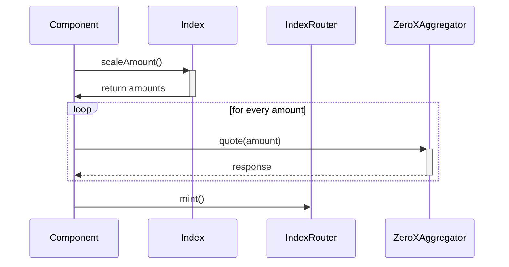

# Examples

## Introduction

Below examples are provided to demonstrate the usage of the different packages available through the PhutureSDK.

# Examples

### [Mint-Swap-Value](./src/mint-swap-value.ts)

This example shows the process of minting 1ETH into an index

The process is as follows:

### Use case: A user wants to mint 1 ETH into the index.

1. First we work out the amount to be minted for each token in the index:

```typescript
// create an instance of the index
const index = new Index(wallet, '0x778b8cc9d9d8e97ab7f6e100e45c1e576bb1d6d4')

// get the amount to be minted for each token in the index
const { amounts, amountToSellQuoted } = await index.scaleAmount(
  amountToSellDesired,
)
```

2. Then for each amount, we get the best possible quote:

```typescript
// loop over all the amounts and get a quote for each one
const quotes = await Promise.all(
  Object.entries(amounts).map(async ([asset, amount]) => {
    const {
      buyAmount: buyAssetMinAmount,
      to: swapTarget,
      data: assetQuote,
    } = await zeroEx.quote('ETH', asset, amount)

    return {
      asset,
      swapTarget,
      buyAssetMinAmount,
      assetQuote,
    }
  }),
)
```

3. Then, we can pass the quotes straight into the indexRouter mint function:

```typescript
await indexRouter.mint(
  {
    index: index.address,
    recipient: wallet.address,
    quotes,
  },
  amountToSellQuoted,
)
```

## Sequence

Below is a sequence diagram for the usecase of a user wishing to mint 1 ETH.
For the sake of brevity, we have omitted the details connecting their wallets.



### [Mint-Various-Products](src/meta-router.ts)

This example shows the process of buying Savings Vault shares through the metaRouter, which allows the user to switch between minting/burning Index and SavingsVault products through a common interface.

The process is as follows:

### Use case: A user wants to deposit 10 USDC into the USDC Savings Vault.

1. First we initialize the Savings Vault and the metaRouter:

```typescript
// create an instance of the Savings Vault
const savingsVault = new SavingsVault(wallet, '0xxxx')

// initialize the metaRouter by passing the addresses of the products we want to use
export const metaRouter = new MetaRouter(indexRouter, zeroEx, {
  [ProductType.INDEX]: [index.address],
  [ProductType.SAVINGS_VAULT]: [savingVault.address],
})
```

2. Then, we can buy the Savings Vault shares by passing the amount of underlying asset to deposit

```typescript
// execute a buy through shares minting
await metaRouter.buy({
  isMint: true,
  erc20Permit: savingsVault,
  amountInInputToken: 10e6,
})
```
