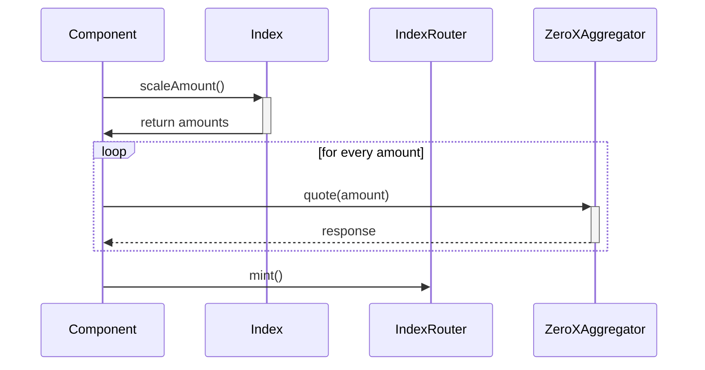

# Examples

## Introduction

Below examples are provided to demonstrate the usage of the different packages available through the PhutureSDK.

# Examples

### [Mint-Swap-Value](./src/mint-swap-value.ts)

This example shows the process of minting 1ETH into an index

The process is as follows:

### Use case: A user wants to mint 1 ETH into the index.

1. First we work out the amount to be minted for each token in the index:

```typescript
// create an instance of the index
const index = new Index(wallet, "0x778b8cc9d9d8e97ab7f6e100e45c1e576bb1d6d4");

// get the amount to be minted for each token in the index
const { amounts, amountToSellQuoted } = await index.scaleAmount(
	amountToSellDesired
);
```

2. Then for each amount, we get the best possible quote:

```typescript
// loop over all the amounts and get a quote for each one
const quotes = await Promise.all(
	Object.entries(amounts).map(async ([asset, amount]) => {
		const {
			buyAmount: buyAssetMinAmount,
			to: swapTarget,
			data: assetQuote,
		} = await zeroEx.quote("ETH", asset, amount);

		return {
			asset,
			swapTarget,
			buyAssetMinAmount,
			assetQuote,
		};
	})
);
```

3. Then, we can pass the quotes straight into the indexRouter mint function:

```typescript
await indexRouter.mint(
	{
		index: index.address,
		recipient: wallet.address,
		quotes,
	},
	amountToSellQuoted
);
```

## Sequence

Below is a sequence diagram for the usecase of a user wishing to mint 1 ETH.
For the sake of brevity, we have omitted the details connecting their wallets.


